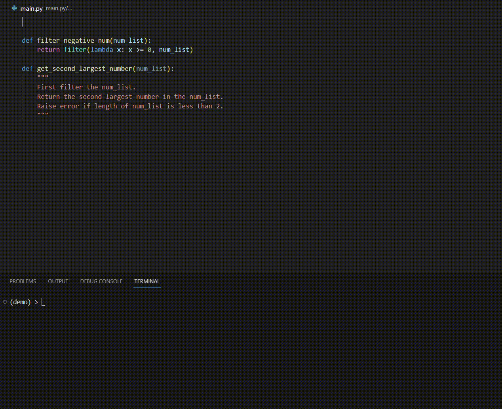

# Wildered

`wildered` is a personal, over-engineered, toy project for integrating your project code and other related information into your LLM prompt without having to copy-paste manually.



## Installation

You can install `wildered` with `pip`.  You need to have Python version of 3.10 or above to use `wildered`.

```
pip install wildered
```

## Basic usage

Suppose that you have two Python scripts:

`test.py`:

```python
from pydantic import BaseModel
from models import Point

def find_y_intercept(point_1: Point, point_2: Point) -> Point:
    """
    Given two points, find and return the y intercept as Point object
    """
    pass
```

`models.py`:
```python
from typing import Any, NamedTuple, TypeAlias
import numpy.typing as npt
import numpy as np

class Point(NamedTuple):
    x: int
    y: int
    
    def as_ndarray(self) -> npt.NDArray:
        return np.array([self.x, self.y])
```

We wish to implement `find_y_intercept` in `test.py`. However, we cannot just copy paste the whole script, as the function depends on the definition of `Point` object, which is in `models.py`. 

Lets see what `wildered` can do.

First, we add directives to the `test.py`.

New `test.py`:

```python
from pydantic import BaseModel
import wildered # You can choose not to import wildered if you want
from models import Point

@wildered.hint([Point])
@wildered.autocomplete()
def find_y_intercept(point_1: Point, point_2: Point) -> Point:
    """
    Given two points, find and return the y intercept as POint object
    """
    pass
```

Now we run the `wildered` cli command:

```bash
wildered test.py
```

`wildered` will format a prompt for you ready to be used for chatbot:

````
I am writing a Python project and I need your help as a code assistant.
Below are the functions or classes that I am working on:

```python
def find_y_intercept(point_1: Point, point_2: Point) -> Point:
    """
    Given two points, find and return the y intercept as POint object
    """
    pass
```

Below are the tasks you need to accomplish:
'''
## Task 1
Implement find_y_intercept function. Follow instruction from docstrings and comments on how to implement the function. Ensure that your answer has type annotations. 

'''
Below are snippets of code in the current project that you may find useful:
```python
from typing import Any, NamedTuple, TypeAlias
import numpy.typing as npt
import numpy as np

class Point(NamedTuple):
    x: int
    y: int

    def as_ndarray(self) -> npt.NDArray:
        return np.array([self.x, self.y])
```

Your answer should only have the functions or class that you are told to implement. Do not repeat other code in your answer
````

Note: Actual output may differ as prompt template changes over time.

A more detailed documentation is still under development. Meanwhile you can learn more by running `wildered --help`

## Future works

- Automatically detect dependencies instead of specifying all of them manually. Also detect the dependencies of the dependencies.
- Improving automatic integration of the LLM response into your project code.